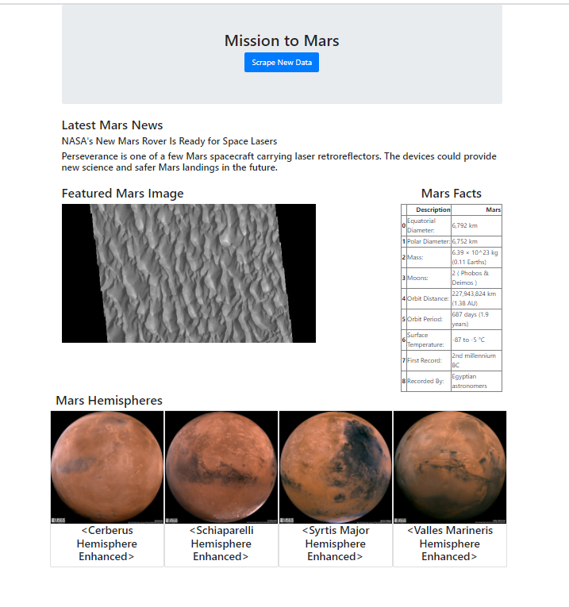

# Web Scraping Challenge

## Overview

In this activity, the goal is to scrape the web for different Mars attributes and place all of the information into one single webpage for a better user experience.

## Scraped Websites

The following websites were used in order to pull different aspects of the webpage.

1. [Nasa Mars News](https://redplanetscience.com/)

2. [Mars Featured Image](https://spaceimages-mars.com)

3. [Mars Facts](https://galaxyfacts-mars.com)

4. [Mars Hemisphere Photos](https://marshemispheres.com/)

# Step 1

1. Create a Jupyter notebook and set up a browser in order to access each website as seen above. `browser.visit(applicable url)`

2. Pull each desired element from the url by defining the location and class via html. `latest_p = soup.find('div', class_='applicable class')`

3. Save the desired element into a dictionary in order for mongodb to access. ` mars_news['element'] = desired_title`

# Step 2

1. Create an application that connects to Mongodb which will drive the information on the webpage. `mongo = PyMongo(app, uri = 'mongodb://localhost:27017/mars')   mars_news_collection = mongo.db.mars_news`

2. Connect the scrape data by creating an application called `/scrape` which pulls the data from the web and saves it to mongodb via the created dictionary. `mars_news = mongo.db.mars_news`

3. Create a collection in order for the data to be pulled from Mongodb to use for the index.html file. `mars_news_collection.update_one({}, {'$set': news_data}, upsert=True)`

# Step 3

1. Create an index.html file in order for the application to display the information in a user friendly way. 

2. Add a button labled "Scrape New Data" which is tied to the scrape function in the app.py file to pull the most recent mars data. `
<a class="btn btn-primary btn-lg" href="/scrape" role="button">Scrape New Data</a>
`

3. Construct the rest of the webpage via bootsrap in order to display the most recent featured image, facts, and hemisphere images. 

## Screenshot Preview

